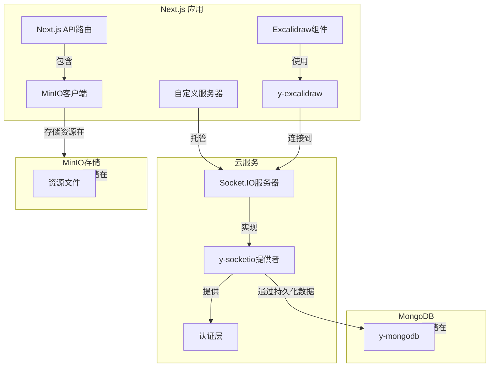

大家好呀，今天简单聊聊如何通过Yjs私有化部署一个支持协同和存储Excalidraw白板的思路

> 公司的需求，其实业务上还是蛮需要一个私有化的白板系统，miro买不起，drawio被嫌弃太丑，倒是excalidraw入了法眼，但是又不肯出什么钱，就给了两天时间研究一下

本身看到了大佬的文章 [链接](https://linux.do/t/topic/522749/1) 再考虑是否可以跟着部署三个服务

但是试用了下来因为本身需要基于一个魔改版的excalidraw，本身和现在官方版本已经隔了很久了，样式上肯定是不符合需求

本身都已经开始考虑放弃这块方案，看看官方的discuss里通过clone一份修改对应环境变量了来通过elcalidraw-room来进行协同了，后端方案豆打算临时不管了

但是在浏览官方api文档的时候，倒是发现可以手动设置协同状态以及手动设置screen上的显示数据

那么如果我用官方的版本，配合上动态修改数据，也可以进行协同啊

本身项目组里的几个项目都是通过yjs进行协同的，那么就动手去github上搜了一下

好巧不巧的是，正好有人开源了 [y-excalidraw](https://github.com/RahulBadenkal/y-excalidraw) 这个项目

简单起了一个demo之后，发现确实意外的好用，协同能力也有，唯一的缺憾就是，因为 y-excalidraw 是将资源也写进了yjs内，那么谁也不想如果有人传了点图之后，yjs的数据大小直接爆炸吧

然后考虑到协同目前还是采用websocket比较方便，如果要处理后续的 拓展/重连等场景的话 [socketio](https://socket.io/zh-CN/docs/v4/) 又是最好的
1. 底层改为next.js手动添加文件上传下载和协同的api
2. 协同改为本地用yjs-indexeddb做离线编辑，y-socketio做协同处理
3. 将存储画板数据全权代理给了，y-socketio服务器，让这边进行持久化

这样做好处不少

1. 可以使用最新的官方excalidraw，保证不会脱节
2. 通过yjs实现的crdt协同，能够有效的实现离线编辑，多人协作
3. 通过socketio实现的websocket服务，能够自动处理重连等场景，未来也方便通过redis等方案去对协同进行扩容
4. 通过nextjs进行整合，一个服务能解决80%的问题（redis/mongo/minio-server之类的没办法）




本身我也封装了一个仓库欢迎试用
[excalidraw-yjs-starter](https://github.com/mizuka-wu/excalidraw-yjs-starter)


剩下的，就让ai分享一下这个项目

## 核心代码结构

项目的核心代码主要分布在以下几个文件中：

### 1. 客户端协作实现 (`src/excalidraw/collab.ts`)

这是项目的核心文件之一，实现了基于 YJS 的协作功能：

```typescript
// 主要功能：提供一个 React Hook，用于设置 Excalidraw 的协作功能
export const useCollab = (
  excalidrawRef: RefObject<HTMLElement | null>,
  options: CollabOptions = {}
) => {
  // ...

  useEffect(() => {
    if (!api) return;

    const ydoc = new Y.Doc();
    // 创建共享数据结构
    const yElements = ydoc.getArray<Y.Map<any>>("elements");
    const yAssets = isStoreApiEnable ? null : ydoc.getMap("assets");

    const isLocalMode = !id;

    // 根据模式选择不同的协作提供者
    // 本地模式：使用 WebRTC 进行点对点通信
    const webRTCProvider = isLocalMode
      ? new WebrtcProvider(`excalidraw-local`, ydoc, {
          signaling: [],
        })
      : null;

    // 本地存储：使用 IndexedDB 持久化数据
    const indexeddbPersistence =
      isUseIndexedDb || isLocalMode
        ? new IndexeddbPersistence(`excalidraw-${id || "default"}`, ydoc)
        : null;

    // 远程模式：使用 Socket.IO 进行服务器通信
    const url = `${location.protocol}//${location.host}`;
    const socketIoProvider = id
      ? new SocketIOProvider(url, `${id}`, ydoc, {})
      : null;

    // 设置撤销/重做管理器
    const undoManagerOptions = !!(
      excalidrawRef.current &&
      excalidrawRef.current.querySelector(".undo-redo-buttons")
    )
      ? {
          excalidrawDom: excalidrawRef.current,
          undoManager: new Y.UndoManager(yElements),
        }
      : undefined;

    // 设置感知（用于光标和用户状态共享）
    const awareness: Awareness =
      socketIoProvider?.awareness ||
      webRTCProvider?.awareness ||
      new Awareness(ydoc);

    // 创建 Excalidraw 绑定
    const binding = new ExcalidrawBinding(
      yElements,
      yAssets,
      api,
      awareness,
      undoManagerOptions
    );

    // ...
  }, [api, excalidrawRef]);

  // ...
};
```

### 2. 服务器端协作实现 (`src/server/collab.ts`)

这个文件实现了服务器端的 YJS 协作功能：

```typescript
import { Server } from "socket.io";
import { YSocketIO } from "y-socket.io/dist/server";
import * as http from "http";

export function createServer(server: ReturnType<typeof http.createServer>) {
  const io = new Server(server);
  // 创建 YSocketIO 服务器实例
  const ySocketIOServer = new YSocketIO(io);
  ySocketIOServer.initialize();
}
```

### 3. Excalidraw 组件封装 (`src/excalidraw/index.tsx`)

这个文件封装了 Excalidraw 组件，并集成了协作和存储功能：

```typescript
const ExcalidrawWrapper: FC<{
  id?: string;
  isUseIndexedDb?: boolean;
}> = ({ id, isUseIndexedDb }) => {
  const excalidrawRef = useRef(null);
  // 使用协作 Hook
  const { setApi: setCollabApi, binding } = useCollab(excalidrawRef, {
    id,
    isUseIndexedDb,
    isStoreApiEnable,
  });

  // 使用存储 Hook
  const { setApi: setStoreApi, resourceManager } = useStore();

  const setApi = (api: ExcalidrawImperativeAPI) => {
    setCollabApi(api);
    if (isStoreApiEnable) setStoreApi(api);
  };

  return (
    <div ref={excalidrawRef} style={{ height: "100vh", width: "100vw" }}>
      <Excalidraw
        excalidrawAPI={setApi}
        isCollaborating={!!binding}
        onPointerUpdate={binding?.onPointerUpdate}
        generateIdForFile={resourceManager?.generateIdForFile}
      />
    </div>
  );
};
```

### 4. 资源管理实现 (`src/excalidraw/store.ts`)

这个文件实现了资源文件（如图片）的管理功能：

```typescript
class ResourceManager {
  api: ExcalidrawImperativeAPI;
  processedFiles = new Set<string>();
  processingFiles = new Set<string>();

  constructor(api: ExcalidrawImperativeAPI) {
    this.api = api;
  }

  // 获取文件
  async getFiles(fileIds: string[]) {
    // 过滤需要处理的文件
    const needProcessFileIds = fileIds.filter((id) => {
      return !this.processedFiles.has(id) && !this.processingFiles.has(id);
    });

    if (needProcessFileIds.length) {
      // 标记为正在处理
      needProcessFileIds.forEach((id) => {
        this.processingFiles.add(id);
      });

      try {
        // 并行获取文件
        const results = await Promise.allSettled(
          needProcessFileIds.map(async (id) => {
            // 获取文件并转换为 dataURL
            // ...
          })
        );

        // 处理获取到的文件
        // ...
      } catch (error) {
        console.error("获取文件失败:", error);
      }
    }
  }

  // 生成文件 ID
  generateIdForFile = async (file: File) => {
    // 生成唯一文件名
    // 上传文件到服务器
    // 返回文件 ID
    // ...
  };
}
```

### 5. API 路由实现 (`src/app/api/route.ts`)

这个文件实现了资源文件的上传和获取 API：

```typescript
// 获取文件
export async function GET(request: NextRequest) {
  const { searchParams } = new URL(request.url);
  const file = searchParams.get("file");
  const raw = searchParams.get("raw") === "true";

  // ...

  try {
    // 生成临时链接
    const presignedUrl = await minioClient.presignedGetObject(
      bucket,
      file,
      60 * 60 // 1小时有效期
    );

    // 根据参数返回文件流或临时链接
    if (raw) {
      const fileStream = await minioClient.getObject(bucket, file);
      return new Response(fileStream as unknown as ReadableStream);
    } else {
      return Response.json({
        url: presignedUrl,
      });
    }
  } catch (error) {
    // 错误处理
    // ...
  }
}

// 上传文件
export async function POST(request: NextRequest) {
  // ...

  try {
    const body = await request.json();
    const { file, key } = body;

    // 将 Base64 编码的文件内容转换为 Buffer
    const fileBuffer = Buffer.from(
      file.split(",")[1] || file,
      "base64"
    );

    // 创建可读流
    const fileStream = Readable.from(fileBuffer);

    // 上传文件到 MinIO
    await minioClient.putObject(bucket, key, fileStream, fileBuffer.length);

    return Response.json({
      success: true,
      message: "文件上传成功",
      key: key,
    });
  } catch (error) {
    // 错误处理
    // ...
  }
}
```

## 路由实现

项目支持两种路由模式：

1. **默认路由 (`/`)**：使用本地 IndexedDB 配合 WebRTC 在页面间保存和协同
   ```typescript
   // src/app/page.tsx
   export default function Home() {
     return (
       <>
         <ExcalidrawWrapper />
       </>
     );
   }
   ```

2. **ID 路由 (`/:id`)**：使用 WebSocket 在同一个 ID 下的客户端之间进行协同
   ```typescript
   // src/app/[id]/page.tsx
   export default function Page({ params, searchParams }: Props) {
     const { id } = params;
     const isUseIndexedDb = searchParams.indexeddb === "true";
     return (
       <>
         <ExcalidrawWrapper id={id} isUseIndexedDb={isUseIndexedDb} />
       </>
     );
   }
   ```

## 技术亮点

1. **多协作模式支持**：同时支持本地模式（WebRTC）和远程模式（WebSocket）
2. **灵活的存储选项**：支持本地存储（IndexedDB）和远程存储（MinIO + MongoDB）
3. **高度可扩展**：架构设计允许轻松扩展认证和持久化功能
4. **资源文件管理**：完整实现了资源文件的上传、存储和获取功能
5. **无缝集成 Excalidraw**：完美集成了 Excalidraw 的所有功能，并扩展了协作能力

## 部署说明

项目支持多种部署方式：

1. **本地开发**：
   ```bash
   npm run dev
   ```

2. **生产部署**：
   ```bash
   npm run build

   cd dist
   node server.js
   ```

3. **Docker 部署**：
   ```bash
   docker build -t excalidraw-yjs .
   docker run -p 3000:3000 excalidraw-yjs
   # 或
   docker-compose up -d
   ```

## 扩展建议

1. **添加用户认证**：在 Socket.IO 服务器上实现认证机制
2. **数据持久化**：使用 y-mongodb 将协作数据存储在 MongoDB 中
3. **自定义 UI**：根据需求定制 Excalidraw 界面
4. **添加更多协作功能**：如用户光标显示、在线用户列表等

## 总结

Excalidraw YJS Starter 项目提供了一个功能完整的协作绘图应用基础框架，通过 YJS 实现了实时协作，通过 MinIO 实现了资源文件管理。项目架构清晰，代码组织合理，可以作为开发类似协作应用的良好起点。